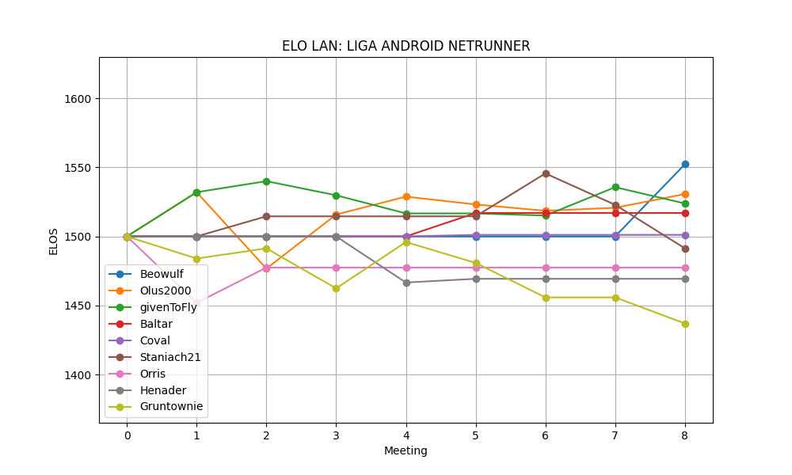
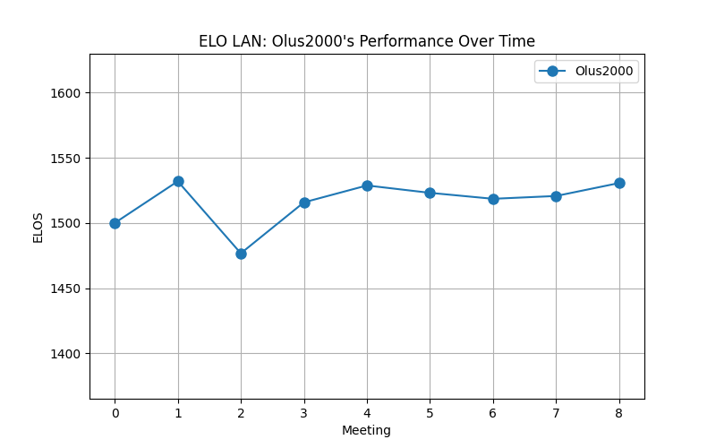
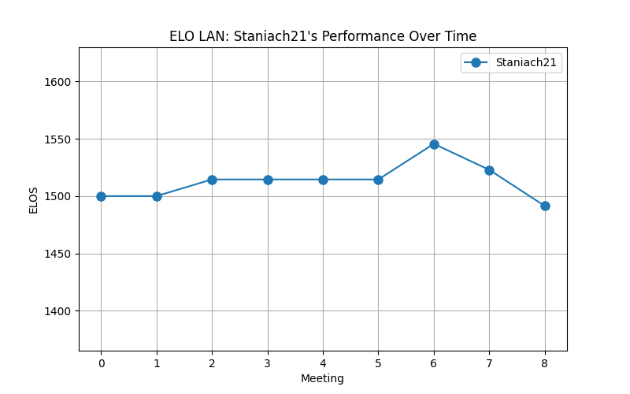
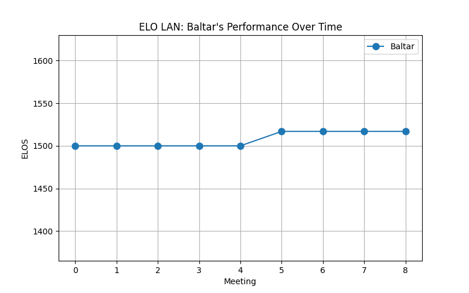
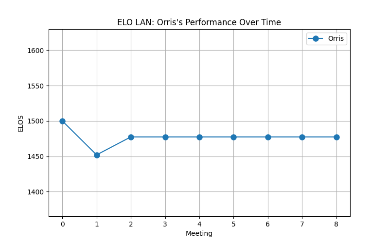
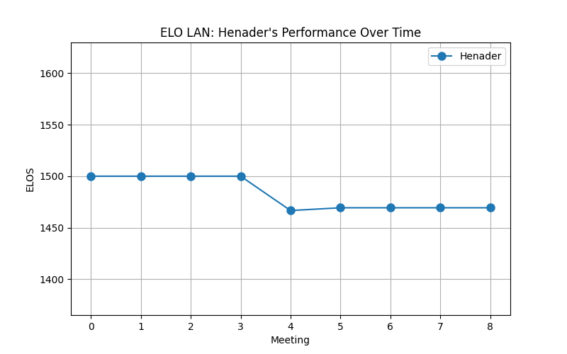

# LAN : Liga Android:Netrunner
>[!info] disclaimer
> this is purely to scratch my itch, this will not determine anything in final scores, just analysis of our meetings

>[!info] V1.1
> removed BYE games from games, does not affect elo, only winrate and h2h

**total rounds** : 4 with **games** : 39

## Elo after all rounds
nick : elo [games]
1. Olus2000 : 1529 [18] 
2. givenToFly : 1517 [19] 
3. Staniach21 : 1515 [7] 
4. Baltar : 1500 [4] 
5. Gruntownie : 1496 [19] 
6. Orris : 1477 [7] 
7. Henader : 1467 [4] 

## Win ratio after all rounds  

> givenToFly **winrate** 57.89% | games (19) 
> Staniach21 **winrate** 57.14% | games (7) 
> Olus2000 **winrate** 55.56% | games (18) 
> Baltar **winrate** 50.00% | games (4) 
> Gruntownie **winrate** 42.11% | games (19) 
> Orris **winrate** 28.57% | games (7) 
> Henader **winrate** 25.00% | games (4) 
## Every player data 
### Olus2000
**win ratio :** *55.56%* 
**total games :** **18** 

#### head to head scores 
(wins-losses-draws)
Total : 10-8-0

vs Staniach21 1-1-0  
vs Gruntownie 3-2-0  
vs givenToFly 4-3-0  
vs Orris 1-1-0  
vs Baltar 1-0-0  
vs Henader 0-1-0  

---
### givenToFly
**win ratio :** *57.89%* 
**total games :** **19** 

#### head to head scores 
(wins-losses-draws)
Total : 11-8-0

vs Staniach21 0-1-0  
vs Gruntownie 5-3-0  
vs Olus2000 3-4-0  
vs Orris 2-0-0  
vs Henader 1-0-0  

---
### Staniach21
**win ratio :** *57.14%* 
**total games :** **7** 

#### head to head scores 
(wins-losses-draws)
Total : 4-3-0

vs Gruntownie 2-0-0  
vs givenToFly 1-0-0  
vs Olus2000 1-1-0  
vs Orris 0-1-0  
vs Baltar 0-1-0  

---
### Baltar
**win ratio :** *50.00%* 
**total games :** **4** 

#### head to head scores 
(wins-losses-draws)
Total : 2-2-0

vs Olus2000 0-1-0  
vs Orris 1-0-0  
vs Gruntownie 0-1-0  
vs Staniach21 1-0-0  

---
### Gruntownie
**win ratio :** *42.11%* 
**total games :** **19** 

#### head to head scores 
(wins-losses-draws)
Total : 8-10-1

vs Staniach21 0-2-0  
vs givenToFly 3-5-0  
vs Olus2000 2-3-0  
vs Orris 0-0-1  
vs Baltar 1-0-0  
vs Henader 2-0-0  

---
### Orris
**win ratio :** *28.57%* 
**total games :** **7** 

#### head to head scores 
(wins-losses-draws)
Total : 2-4-1

vs Gruntownie 0-0-1  
vs Staniach21 1-0-0  
vs givenToFly 0-2-0  
vs Olus2000 1-1-0  
vs Baltar 0-1-0  

---
### Henader
**win ratio :** *25.00%* 
**total games :** **4** 

#### head to head scores 
(wins-losses-draws)
Total : 1-3-0

vs givenToFly 0-1-0  
vs Olus2000 1-0-0  
vs Gruntownie 0-2-0  

---
